# SI-Exercises-MS-DOS
ol.lst-kix\_npavc26fo1rs-3.start{counter-reset:lst-ctn-kix\_npavc26fo1rs-3 0}.lst-kix\_npavc26fo1rs-6>li:before{content:"" counter(lst-ctn-kix\_npavc26fo1rs-6,decimal) ". "}.lst-kix\_npavc26fo1rs-7>li:before{content:"" counter(lst-ctn-kix\_npavc26fo1rs-7,lower-latin) ". "}.lst-kix\_npavc26fo1rs-4>li:before{content:"" counter(lst-ctn-kix\_npavc26fo1rs-4,lower-latin) ". "}.lst-kix\_npavc26fo1rs-5>li:before{content:"" counter(lst-ctn-kix\_npavc26fo1rs-5,lower-roman) ". "}.lst-kix\_npavc26fo1rs-8>li:before{content:"" counter(lst-ctn-kix\_npavc26fo1rs-8,lower-roman) ". "}.lst-kix\_npavc26fo1rs-1>li{counter-increment:lst-ctn-kix\_npavc26fo1rs-1}.lst-kix\_npavc26fo1rs-2>li:before{content:"" counter(lst-ctn-kix\_npavc26fo1rs-2,lower-roman) ". "}.lst-kix\_npavc26fo1rs-3>li:before{content:"" counter(lst-ctn-kix\_npavc26fo1rs-3,decimal) ". "}ol.lst-kix\_npavc26fo1rs-8.start{counter-reset:lst-ctn-kix\_npavc26fo1rs-8 0}.lst-kix\_npavc26fo1rs-4>li{counter-increment:lst-ctn-kix\_npavc26fo1rs-4}.lst-kix\_npavc26fo1rs-7>li{counter-increment:lst-ctn-kix\_npavc26fo1rs-7}.lst-kix\_npavc26fo1rs-2>li{counter-increment:lst-ctn-kix\_npavc26fo1rs-2}ol.lst-kix\_npavc26fo1rs-7{list-style-type:none}ol.lst-kix\_npavc26fo1rs-6{list-style-type:none}ol.lst-kix\_npavc26fo1rs-0.start{counter-reset:lst-ctn-kix\_npavc26fo1rs-0 0}ol.lst-kix\_npavc26fo1rs-8{list-style-type:none}.lst-kix\_npavc26fo1rs-8>li{counter-increment:lst-ctn-kix\_npavc26fo1rs-8}.lst-kix\_npavc26fo1rs-5>li{counter-increment:lst-ctn-kix\_npavc26fo1rs-5}ol.lst-kix\_npavc26fo1rs-1{list-style-type:none}ol.lst-kix\_npavc26fo1rs-0{list-style-type:none}ol.lst-kix\_npavc26fo1rs-3{list-style-type:none}ol.lst-kix\_npavc26fo1rs-2{list-style-type:none}ol.lst-kix\_npavc26fo1rs-5{list-style-type:none}ol.lst-kix\_npavc26fo1rs-4{list-style-type:none}ol.lst-kix\_npavc26fo1rs-5.start{counter-reset:lst-ctn-kix\_npavc26fo1rs-5 0}.lst-kix\_npavc26fo1rs-0>li{counter-increment:lst-ctn-kix\_npavc26fo1rs-0}ol.lst-kix\_npavc26fo1rs-4.start{counter-reset:lst-ctn-kix\_npavc26fo1rs-4 0}ol.lst-kix\_npavc26fo1rs-2.start{counter-reset:lst-ctn-kix\_npavc26fo1rs-2 0}ol.lst-kix\_npavc26fo1rs-7.start{counter-reset:lst-ctn-kix\_npavc26fo1rs-7 0}li.li-bullet-0:before{margin-left:-18pt;white-space:nowrap;display:inline-block;min-width:18pt}.lst-kix\_npavc26fo1rs-0>li:before{content:"" counter(lst-ctn-kix\_npavc26fo1rs-0,decimal) ". "}.lst-kix\_npavc26fo1rs-1>li:before{content:"" counter(lst-ctn-kix\_npavc26fo1rs-1,lower-latin) ". "}ol.lst-kix\_npavc26fo1rs-6.start{counter-reset:lst-ctn-kix\_npavc26fo1rs-6 0}.lst-kix\_npavc26fo1rs-6>li{counter-increment:lst-ctn-kix\_npavc26fo1rs-6}ol.lst-kix\_npavc26fo1rs-1.start{counter-reset:lst-ctn-kix\_npavc26fo1rs-1 0}.lst-kix\_npavc26fo1rs-3>li{counter-increment:lst-ctn-kix\_npavc26fo1rs-3}ol{margin:0;padding:0}table td,table th{padding:0}.c0{color:#000000;font-weight:400;text-decoration:none;vertical-align:baseline;font-size:11pt;font-family:"Arial";font-style:normal}.c1{padding-top:0pt;padding-bottom:0pt;line-height:1.15;orphans:2;widows:2;text-align:left}.c4{text-decoration-skip-ink:none;-webkit-text-decoration-skip:none;color:#1155cc;text-decoration:underline}.c5{background-color:#ffffff;max-width:451.4pt;padding:72pt 72pt 72pt 72pt}.c6{color:inherit;text-decoration:inherit}.c3{margin-left:36pt;padding-left:0pt}.c7{padding:0;margin:0}.c2{height:11pt}.c8{margin-left:36pt}.title{padding-top:0pt;color:#000000;font-size:26pt;padding-bottom:3pt;font-family:"Arial";line-height:1.15;page-break-after:avoid;orphans:2;widows:2;text-align:left}.subtitle{padding-top:0pt;color:#666666;font-size:15pt;padding-bottom:16pt;font-family:"Arial";line-height:1.15;page-break-after:avoid;orphans:2;widows:2;text-align:left}li{color:#000000;font-size:11pt;font-family:"Arial"}p{margin:0;color:#000000;font-size:11pt;font-family:"Arial"}h1{padding-top:20pt;color:#000000;font-size:20pt;padding-bottom:6pt;font-family:"Arial";line-height:1.15;page-break-after:avoid;orphans:2;widows:2;text-align:left}h2{padding-top:18pt;color:#000000;font-size:16pt;padding-bottom:6pt;font-family:"Arial";line-height:1.15;page-break-after:avoid;orphans:2;widows:2;text-align:left}h3{padding-top:16pt;color:#434343;font-size:14pt;padding-bottom:4pt;font-family:"Arial";line-height:1.15;page-break-after:avoid;orphans:2;widows:2;text-align:left}h4{padding-top:14pt;color:#666666;font-size:12pt;padding-bottom:4pt;font-family:"Arial";line-height:1.15;page-break-after:avoid;orphans:2;widows:2;text-align:left}h5{padding-top:12pt;color:#666666;font-size:11pt;padding-bottom:4pt;font-family:"Arial";line-height:1.15;page-break-after:avoid;orphans:2;widows:2;text-align:left}h6{padding-top:12pt;color:#666666;font-size:11pt;padding-bottom:4pt;font-family:"Arial";line-height:1.15;page-break-after:avoid;font-style:italic;orphans:2;widows:2;text-align:left}

CORTAVARRIA ,José Noel

[https://github.com/Noelgithub-boop/MS-DOS-EXERCICIS.git](https://www.google.com/url?q=https://github.com/Noelgithub-boop/MS-DOS-EXERCICIS.git&sa=D&source=editors&ust=1651680759833673&usg=AOvVaw3h8RVc_SfThKn5HM6cw9tD) 

ACTIVIDAD 1

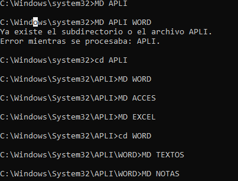

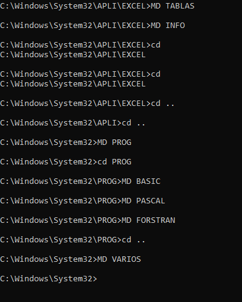

ACTIVIDAD 2

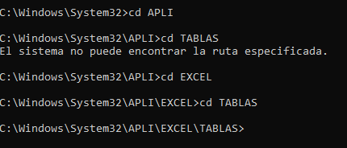

actividad 3

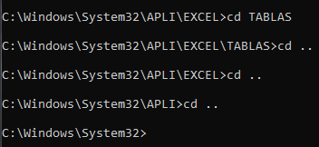

actividad 4

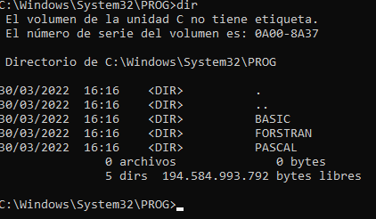

actividad 5

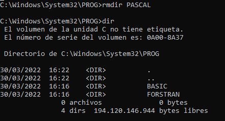

actividad 6

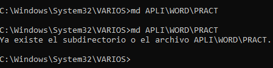

A7

A8. 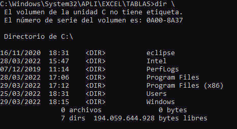

A9 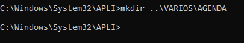

A10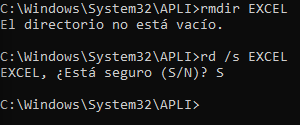

A11 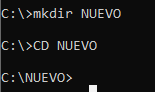

A12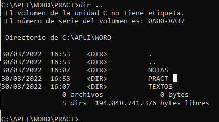

PARTE 2:

1.  no he logrado acceder al editor de texto de la cmd asi que he usado otro método para crear un archivo.txt

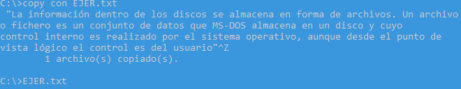

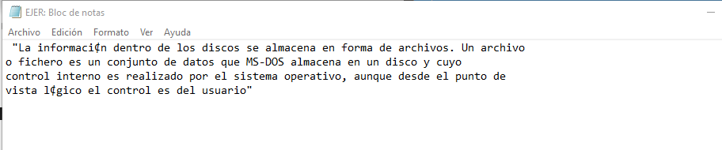

2.

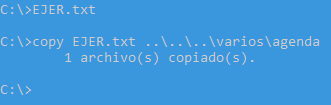

3.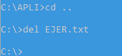

4.añadir texto

5.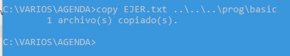

6\. 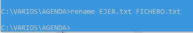

7.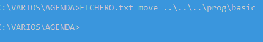

8.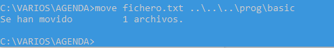

9.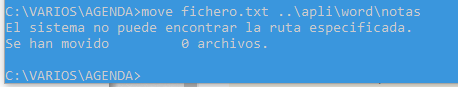

10\. 

1.

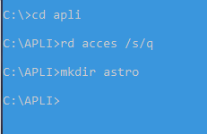

2.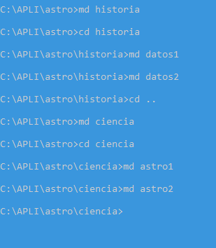

3.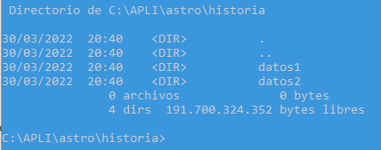

4.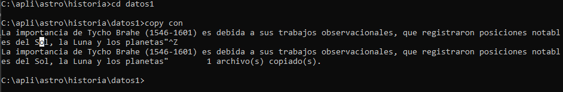

5.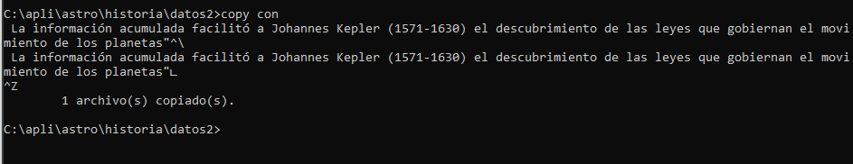

6\. 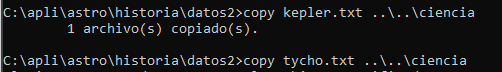

7.

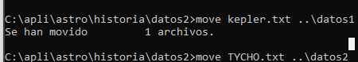

8.

9.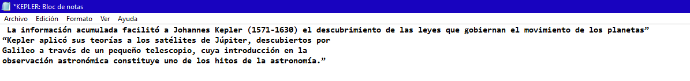

10\. 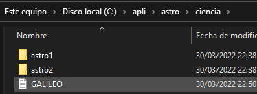

parte 3

1.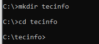

2 Y 3 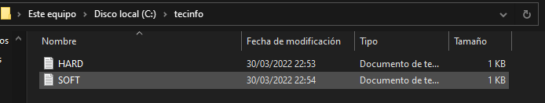

4\. 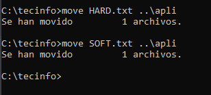

5.

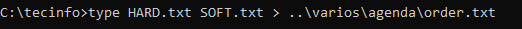

6.

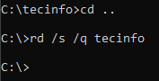

7.

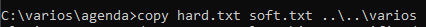

8.

9.

10.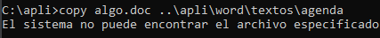
