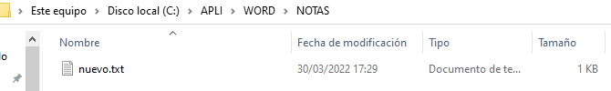

# SI-Exercises-MS-DOS

CORTAVARRIA ,José Noel

[https://github.com/Noelgithub-boop/MS-DOS-EXERCICIS.git](https://www.google.com/url?q=https://github.com/Noelgithub-boop/MS-DOS-EXERCICIS.git&sa=D&source=editors&ust=1651680759833673&usg=AOvVaw3h8RVc_SfThKn5HM6cw9tD) 

ACTIVIDAD 1

ACTIVIDAD 2

actividad 3

actividad 4

actividad 5

actividad 6

A7

A8. 

A9 

A10

A11 

A12

PARTE 2:

1.  no he logrado acceder al editor de texto de la cmd asi que he usado otro método para crear un archivo.txt

2.

3.

4.añadir texto

5.

6\. 

7.

8.

9.

10\. 

1.

2.

3.

4.

5.

6\. 

7.

8.

9.

10\. 

parte 3

1.

2 Y 3 

4\. 

5.

6.

7.

8.

9.

10.
